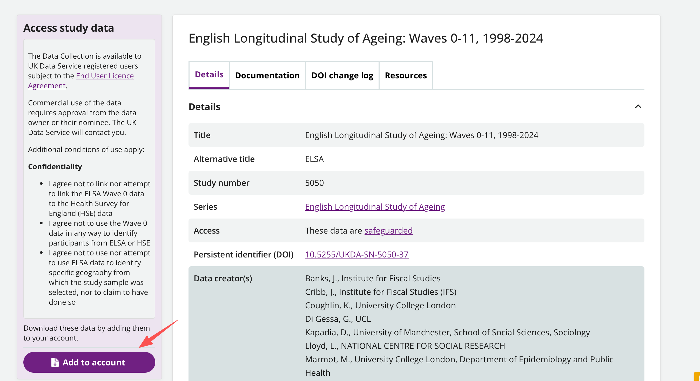
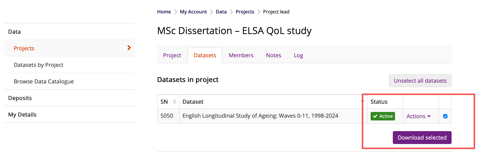
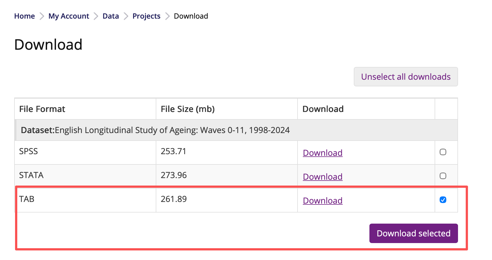
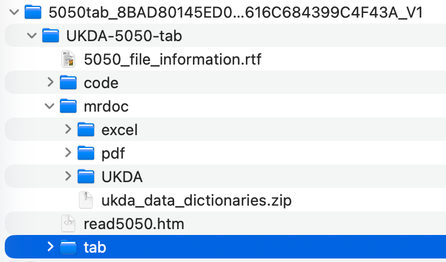
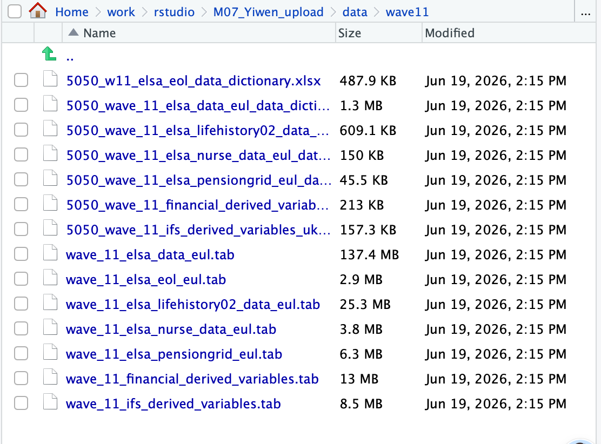

# M07 HDS Final Project

This repository contains the code and reproducibility materials for my HDS final project.

**Dissertation Title:** Identifying Low Quality of Life among Older Adults in England Using Machine Learning: An Analysis of ELSA Wave 11

The GitHub version includes the analysis scripts, README, output tables, and figures. The raw ELSA Wave 11 data and processed datasets are not uploaded because they are subject to UK Data Service access and licence restrictions.

## Data source

The data come from the English Longitudinal Study of Ageing (ELSA), Wave 11. The study page is available here:

https://datacatalogue.ukdataservice.ac.uk/studies/study/5050#details



After signing in to the UK Data Service, add the study to your account. The data are listed as safeguarded, so users need to follow the UK Data Service licence conditions. Download the TAB version of the dataset and unzip it locally.







Use the seven Wave 11 `.tab` files from:

```text
UKDA-5050-tab/tab/
```

Use the seven Wave 11 data dictionary Excel files from:

```text
UKDA-5050-tab/mrdoc/excel/
```

After finding these files, place them in the local project folder:

```text
data/wave11/
```

The screenshot below shows the full local file list used in `data/wave11/`.



## R project folders

- `data/wave11/`: local folder for raw ELSA Wave 11 files and data dictionaries. Only a README placeholder is uploaded.
- `data/upload/`: manual input files used by the scripts, such as the preliminary feature-selection spreadsheet.
- `data/processed/`: local folder for generated intermediate datasets, model objects, and prediction files. Only a README placeholder is uploaded.
- `output/`: exported result tables.
- `pictures/`: figures used in the analysis and README.
- `script/`: R and R Markdown analysis scripts.
- `script/html/`: optional rendered HTML files, if generated locally.

## Script execution order

Run the scripts from a clean R session in this order:

```text
00_packages.R
01_import_wave11.Rmd
02_functions.R
03_build_wave11_metadata.Rmd
04_variable_matching.Rmd
05_filter_analysis_sample.Rmd
06_outcome_casp19.Rmd
07_EDA01_base_features.Rmd
07_EDA02_additional_features.Rmd
07_EDA03_feature_screening.Rmd
08_model_development_training_only.Rmd
09_heldout_test_evaluation.Rmd
10_exploratory_lasso_weight_threshold.Rmd
11_exploratory_ensemble_analysis.Rmd
```

For the paired files `00_packages.R` / `00_packages.Rmd` and `02_functions.R` / `02_functions.Rmd`, use the `.R` files for execution or sourcing. The `.Rmd` versions were kept mainly to create readable rendered HTML output.

## Script overview

- `00_packages.R`: loads packages and sets shared paths.
- `00_packages.Rmd`: readable/rendered version of the package setup.
- `01_import_wave11.Rmd`: imports the Wave 11 raw data files.
- `02_functions.R`: stores helper functions used by later scripts.
- `02_functions.Rmd`: readable/rendered version of the helper functions.
- `03_build_wave11_metadata.Rmd`: builds variable metadata and value-label information.
- `04_variable_matching.Rmd`: records how candidate variables were identified.
- `05_filter_analysis_sample.Rmd`: applies the main sample filters.
- `06_outcome_casp19.Rmd`: creates the CASP-19 score and binary low quality-of-life outcome.
- `07_EDA01_base_features.Rmd`: builds the first modelling dataset using selected base features.
- `07_EDA02_additional_features.Rmd`: adds further candidate predictors from Wave 11.
- `07_EDA03_feature_screening.Rmd`: screens features for missingness and sparse categories.
- `08_model_development_training_only.Rmd`: develops and tunes the machine learning models on the training data.
- `09_heldout_test_evaluation.Rmd`: evaluates the fixed models on the held-out test set.
- `10_exploratory_lasso_weight_threshold.Rmd`: checks class weights and decision thresholds for the LASSO model.
- `11_exploratory_ensemble_analysis.Rmd`: explores majority-voting ensembles across selected models.

## Notes

The full workflow requires authorised access to ELSA Wave 11. Files in `data/wave11/` and `data/processed/` are intentionally excluded from GitHub and should be added or regenerated locally by users with the appropriate data access.
